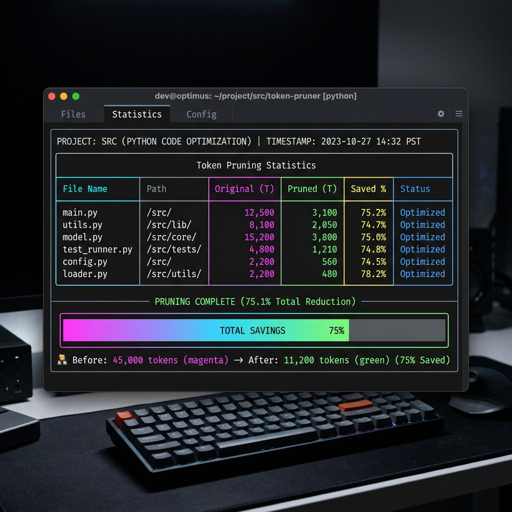

# CoreContext 🧠

**CoreContext** is a powerful, AST-based CLI code compression tool written in Python. It optimizes and packs codebase files for LLM prompting (ChatGPT, Claude, Gemini, etc.).

Unlike generic text/whitespace cleaners, **CoreContext** parses your codebase into an Abstract Syntax Tree (AST), understands code semantics, strips docstrings/comments/logs, stubs out non-critical function bodies, and cleans up unused imports. This preserves accurate type hints and architectural definitions while **saving up to 70-80% of LLM token costs**!



---

## ✨ Features

*  **Unified Context**: Outputs a single, compact `context.md` file containing a Markdown directory tree and the sorted code files.
*  **AST-Based Pruning**:
  - Automatically strips single-line and multi-line comments and docstrings.
  - Keeps all class and function signatures, inheritance structures, and type hints intact.
  - Stubs non-critical function bodies using `...` (Ellipsis) to maximize token savings.
*  **Logging Eraser**: Discards log lines (e.g. `logger.info`, `logging.debug`, `self.logger.warning`, and optionally `print`) from files.
*  **Import Optimization**: Detects and cleans up module-level imports that become unused after function bodies are pruned.
*  **Dependency-Aware Ordering**: Resolves file imports and topologically sorts files (dependencies first). This logical seqence helps LLMs analyze code sequentially.
*  **Token Savings Diagnostics**: Integrated `tiktoken` (`cl100k_base`) token counter reports "Before vs After" stats and renders a colorful progress bar in the terminal.
*  **Gitignore Support**: Respects project `.gitignore` patterns and applies default ignore lists (e.g. `node_modules`, `venv`, `__pycache__`).
*  **Silent Recovery**: Safely handles syntactically invalid or unreadable files by logging a warning and logging the raw unpruned file contents rather than failing the process.

---

## Installation

Ensure you have Python 3.11+ installed.

### Using Poetry
```bash
# Clone the repository
git clone https://github.com/your-username/corecontext.git
cd corecontext

# Install dependencies
poetry install
```

### Using Pip
```bash
pip install -r requirements.txt
```

---

##  Usage

### Running with Poetry
```bash
poetry run corecontext prune --dir <project_path> --output context.md
```

### Running with Python
```bash
python -m src.cli prune --dir <project_path> --output context.md
```

### CLI Options:
* `--dir <path>` — The project directory to analyze (default: `.`).
* `--output <file>` — Output Markdown filepath (default: `context.md`).
* `--critical <func_name>` — Protect a function body from being stubbed (can pass multiple times, e.g. `--critical main --critical run_app`).
* `--prune-init` — Enable pruning `__init__` constructor bodies (default: constructor bodies are kept to preserve instance properties).
* `--no-strip-logging` — Disable stripping logging calls.
* `--strip-print` — Enable stripping `print(...)` statements from bodies.
* `--no-optimize-imports` — Disable unused import removal.
* `--exclude <pattern>` — Add extra ignore glob patterns (e.g. `--exclude "*.json"`).

---

## 🛠️ Architecture

* `src/parser.py` — File system traversal, `.gitignore` parsing, and AST parsing (designed with an extension point for Tree-sitter for TS/JS support).
* `src/pruner.py` — AST optimization engine containing transformers for docstring deletion, logging extraction, body stubbing, and import analysis.
* `src/graph.py` — Dotted import resolver and topological sorter.
* `src/cli.py` — Click commands, rich terminal graphics, and tiktoken analysis.

---

## 🧪 Testing

To run unit tests:
```bash
PYTHONPATH=. pytest
```
Or via Poetry:
```bash
poetry run pytest
```
